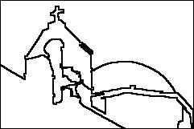

# Color Image Segmentation using Evolutionary Algorithms

The goal of this project:

- Implement a multi-objective evolutionary elgorithm for color image segmentation
- Implement a simple weighted-sum genetic algorithm for color image segmentation
- Compare the results of the two implemented solutions on several benchmark problems
- Test and analyze the effects of MOEA(s) in optimizing multiple objectives simultaneously.

## Image segmentation

Image segmentation is a fundamental process in many image, video and computer vision
applications. The main goal is to partition an image into separate regions of pixels, which ideally
correspond to different real-world objects.

| Original Image                                |                 Type 1 segmentation                 |                                 Type 2 segmentation |
| --------------------------------------------- | :-------------------------------------------------: | --------------------------------------------------: |
|  |  |  |

## NSGA 2

NSGA-II is a modification of NSGA. NSGA-II computes the cost
of an individual x by taking into account not only the individuals that dominate
it, but also the individuals that it dominates. For each individual, we also compute
a crowding distance by finding the distance to the nearest individuals along each
objective function dimension.

## Information sources and inspiration

- [A Multi-Objective Evolutionary Algorithm for Color Image Segmentation. Ripon, Ali, Newaz, Ma](https://ntnuopen.ntnu.no/ntnu-xmlui/bitstream/handle/11250/2494597/A_Multi-Objective_Evolutionary_Algorithm_for_Color_Image_Segmentation.pdf?sequence=4&isAllowed=y)

- [Introduction to Evolutionary Computing. Smith, Eiben](https://link.springer.com/book/10.1007/978-3-662-44874-8)
